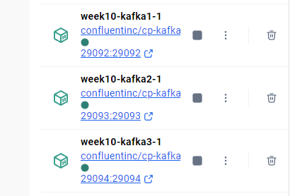
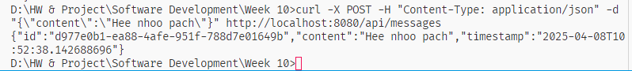
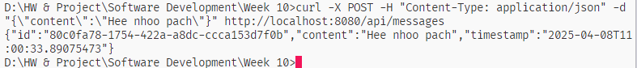
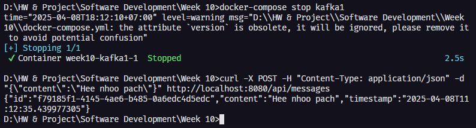

# Spring Boot Kafka Cluster Project

This project demonstrates a fault-tolerant Kafka cluster setup with Spring Boot applications that exchange JSON data through Kafka. The setup includes a 3-node Kafka cluster and two Spring Boot applications (producer and consumer).

## Structure

- `kafka-producer-service`: Spring Boot application that sends JSON messages to Kafka
- `kafka-consumer-service`: Spring Boot application that consumes messages from Kafka
- Docker Compose configuration for setting up a 3-node Kafka cluster



## Prerequisites

- Docker and Docker Compose
- Java 17
- Maven

## Setting Up and Running the Application

1. Clone the repository
2. Navigate to the project root directory
3. Start the applications with Docker Compose:

```bash
docker-compose up -d
```

4. Wait for all services to initialize (this may take a minute)

## Using the Application

### Sending Messages

To send a message to Kafka through the producer service:

```bash
curl -X POST -H "Content-Type: application/json" -d "{\"content\":\"Test message\"}" http://localhost:8080/api/messages
```



When using three cluesters:




### Viewing Consumed Messages

To check if the consumer service has received the message:

```bash
docker-compose logs -f consumer
```

## Testing Kafka Cluster Fault Tolerance

### Checking the Current Leader

To identify which Kafka broker is the leader for the `messages-topic`:

```bash
docker exec kafka1 kafka-topics --describe --topic messages-topic --bootstrap-server kafka1:9092 | findstr Leader
```

### Stopping the Leader Broker

Once you know the leader's ID (1, 2, or 3), you can stop it to test fault tolerance:

```bash
docker-compose stop kafka<ID>
```

For example, if broker 1 is the leader:

```bash
docker-compose stop kafka1
```

### Testing the System After Leader Failure

Wait about 10 seconds for leader re-election, then send a new message:

```bash
curl -X POST -H "Content-Type: application/json" -d "{\"content\":\"Test message after leader failure\"}" http://localhost:8080/api/messages
```

Check the consumer logs to verify the message was received:

```bash
docker-compose logs -f consumer
```

